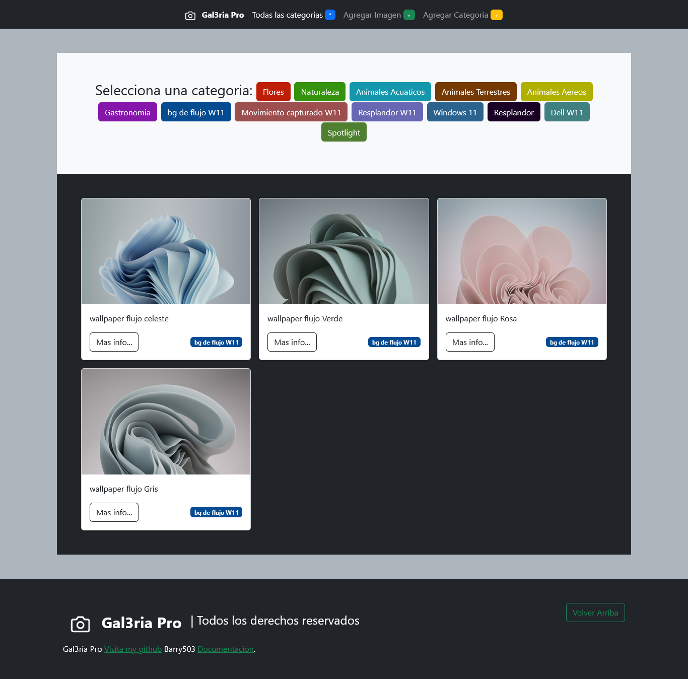

# Galeria Pro
Galeria para guardar tus mejores fotografias

# Requerimientos
tener instalado xamp y habilitarvlos modulos de php y mysql

colocar la carpeta gal3ria en el servidor

importar la base de datos en phpmyadmin

# Creado Por: [barry503](https://github/barry503)